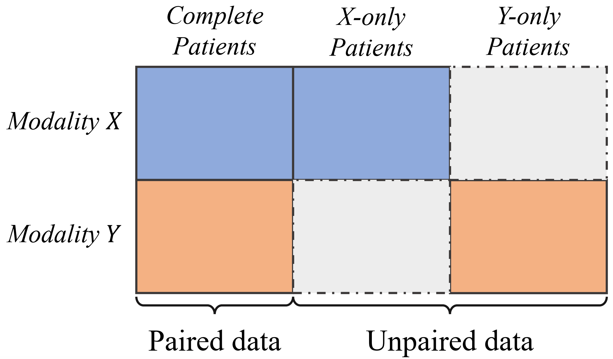
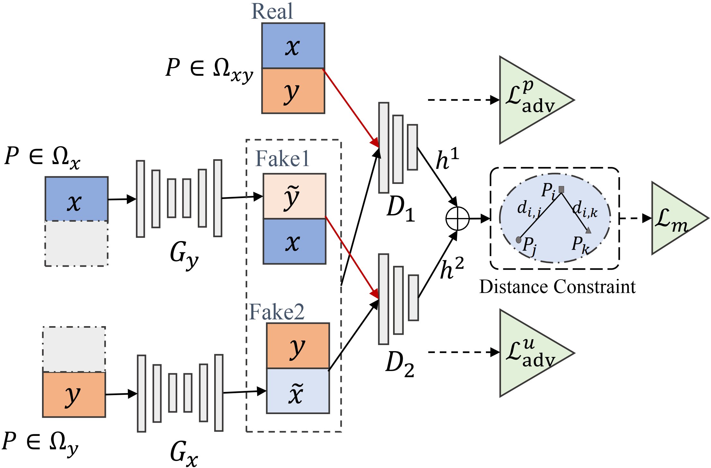

# Metric Learning on Healthcare Data with Incomplete Modalities
This is a TensorFlow implementation of MeLIM (Metric Learning with Incomplete Modalities) https://doi.org/10.24963/ijcai.2019/490. 

## Overview
MeLIM focuses on the missing-modal problem in multi-modal metric learning. A sample illustration of the data can be seen in the figure:

<p align="center"></p>

The overall framework is designed through a joint optimization of modality generation and training of metric learning. We employ the generative adversarial network (GAN) to capture the relationship between modalities. The missing modalities are imputed by mapping the existing modalities through generators. We then connect the imputation part with metric learning by incorporating an auxiliary task in the discriminator to make use of the extracted non-linear abstract multi-modal representations. The proposed framework is shown below:

<p align="center"></p>

## Requirements
This package has the following requirements:
* `Python 3.x`
* [TensorFlow](https://github.com/tensorflow/tensorflow)


## Usage

### Prepare data
We use [ANDI](https://ida.loni.usc.edu/login.jsp?project=ADNI&page=HOME) image dataset in our paper. There are two modalities in total: MRI and PET The data is preprocessed and saved in h5 format. We use 2D images with size 32x32. There are two types of training data: train_pair (modality-complete) and train_unpair (with missing modality). The paried data file contains three keys ('label', 'mri', 'pet'), and unpaired data file contains four keys ('mri', 'pet', 'mri_label', 'pet_label').

### Configurations
Network hyperparameters are configured in main.py. We use the default hyperparameters of network structure in our experiments. There are some configurations of experimental settings:

--classes: the classes of binary classification: distinguishing CN_AD, or MCI_AD.

--portion: number of paired (complete) data samples in training. We change it to investigate model performance regarding the ratio of paired and unpaired data.

--suffix: file name, to keep track of each experiments.


### Run proposed method
python main.py --model proposed --classes CN_AD --gpu 1 --portion 100 --suffix p100_upm

Trained models are saved in `modeldir`. Samples of generated images are saved in `samples` directory.


## Citation
Please consider citing this paper in your publications if you find the source code useful to your research.

```
@inproceedings{suo2019metric,
  title={Metric learning on healthcare data with incomplete modalities},
  author={Suo, Qiuling and Zhong, Weida and Ma, Fenglong and Yuan, Ye and Gao, Jing and Zhang, Aidong},
  booktitle={Proceedings of the 28th International Joint Conference on Artificial Intelligence},
  pages={3534--3540},
  year={2019},
  organization={AAAI Press}
}
```

